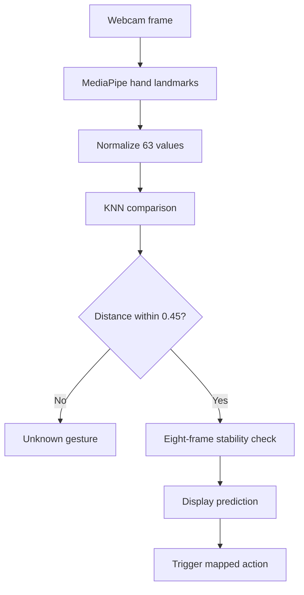

# KRIYA AI

> **Teach a gesture. Trigger an action.**

KRIYA AI is a browser-based personal gesture studio that allows users to create their own hand gestures, train the application with examples and connect each gesture to a virtual action.

## Project idea

Most gesture-control systems recognize only gestures programmed by their developers. KRIYA reverses that relationship: the user decides what a gesture means.

A person can:

1. create a gesture class;
2. choose an action;
3. capture training samples;
4. let KRIYA classify the gesture in real time;
5. trigger the assigned action without touching a mouse or keyboard.

## Main features

- Real-time webcam access
- AI hand-landmark detection
- 21 landmarks visualized on the hand
- User-created gesture classes
- 63-value normalized training samples
- K-Nearest Neighbours classification
- Three-neighbour voting
- Eight-frame prediction stabilization
- Unknown-gesture rejection
- Confidence and distance explanation
- Gesture-controlled virtual actions
- Training persistence with `localStorage`
- Individual and complete training-data deletion
- Responsive and semantic interface

## AI pipeline



## Supported actions

| Action value | Demonstration |
|---|---|
| `next` | Move to the next card |
| `previous` | Move to the previous card |
| `play` | Play or pause the virtual media player |
| `light` | Toggle the virtual light |
| `none` | Recognize the gesture without performing an action |

## Technologies

- Semantic HTML5
- CSS3
- Vanilla JavaScript
- MediaPipe Tasks Vision
- K-Nearest Neighbours
- Browser `localStorage`
- Git and GitHub

No paid API, database or server-side framework is required.

## How the AI works

MediaPipe detects 21 hand landmarks. Each landmark contains `x`, `y` and `z` coordinates:

```text
21 landmarks × 3 coordinates = 63 values
```

KRIYA moves the wrist to the origin and scales the coordinates relative to the detected hand. This reduces the effects of screen position, camera distance and hand size.

The KNN classifier compares a live sample with saved samples using Euclidean distance. The three nearest samples vote for the predicted gesture.

A gesture must also:

- have a nearest distance no greater than `0.45`;
- remain consistent for eight consecutive camera frames.

These checks reduce false and unstable actions.

## Privacy

Camera frames and gesture classification are processed inside the browser. KRIYA stores only gesture names, action mappings and normalized landmark values in the browser's local storage.

No account, cloud database or paid service is required.

## Run locally

### Requirements

- A modern browser
- A webcam
- Python installed
- An internet connection to load the MediaPipe library and model

### Steps

1. Clone or download the project.
2. Open the project folder in VS Code.
3. Start a local server:

```powershell
py -m http.server 5500
```

4. Open:

```text
http://localhost:5500
```

5. Allow camera permission when requested.

## Recommended training

For reliable classification:

- create at least two different gesture classes;
- capture at least five samples for each gesture;
- slightly vary hand position and angle;
- keep sample counts reasonably balanced;
- choose visually distinct gestures.

## Git workflow

The project was developed through milestone commits for:

- semantic HTML;
- visual design;
- DOM events;
- webcam controls;
- AI landmark detection;
- normalized sample collection;
- KNN classification;
- temporal stability;
- gesture-triggered actions;
- local persistence;
- unknown-gesture rejection.

The unknown-gesture feature was developed on:

```text
feature/unknown-gesture-rejection
```

and merged into `main` after testing.

## Current limitations

- KRIYA recognizes static hand poses rather than motion-based gestures.
- Training data is stored separately in each browser.
- Accuracy depends on lighting, camera quality and training-sample quality.
- The current rejection threshold may require tuning for different users.

## Future improvements

- Dynamic motion gestures
- Import and export of trained gesture profiles
- Adaptive rejection thresholds
- Multiple-hand interaction
- More real-world browser actions
- Training-quality visualization

## Project slogan

**KRIYA AI — Teach a gesture. Trigger an action.**